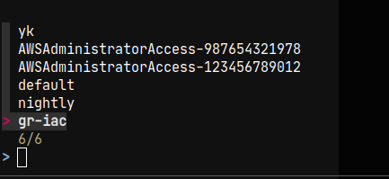

# Forbedre UX for `aws sso login`

Putter dette her for å beskrive hvordan man forholdsvis enkelt kunne forbedret UX for login med AWS SSO.

Manuelt:

```sh
$ aws sso login
Missing the following required SSO configuration values: sso_start_url, sso_region, sso_role_name, sso_account_id. To make sure this profile is properly configured to use SSO, please run: aws configure sso

# Bruker skjønner nada. Finner til slutt ut av hva som må gjøres.

$ aws configure sso

...

$ export AWS_PROFILE=AWSAdministratorAccess-123456789012 # Gørr å skrive denne for hver nye terminal, hver dag

$ aws sso login

...

$ aws s3 ls

2021-01-06 11:20:26 my-bucket
```

Med hjelpescript: [okctl-sso-login.sh](okctl-sso-login.sh)
* Kan gjøres greit i Bash (enn så lenge), trenger ikke Go.
    * Tanken er at `okctl` bare kaller Bash-scriptet og forwarder argumenter.
* Guider brukeren til hvordan logge inn
* Setter opp miljøvariabel, så brukeren slipper å kjøre `export AWS_PROFILE=...`

Tenkt bruksmønster (PS: [okctl-sso-login.sh](okctl-sso-login.sh) gjør ikke alt det som skjer under, scriptet er kun en
mininmal versjon jeg bruker selv):

```sh
$ . okctl sso login
```

Bruker får opp:



```sh
# ok detekterer at `aws configure sso` ikke er kjørt. Brukeren får tips om hvordan man logger inn
To setup AWS environment, run:
aws configure sso

From now on you can run
. okctl sso login

$ aws configure sso

# Fra nå av kan brukeren kun kjøre denne kommandoen for å logge inn.
$ . okctl sso login

>
  3/3
  default
  AWSAdministratorAccess-321564987123
  AWSAdministratorAccess-123456789012

# Brukeren velger konto i drop down over (bruker verktøyet fzf)

You are now logged in with AWS_PROFILE=AWSAdministratorAccess-123456789012
Test it out with: aws s3 ls

$ aws s3 ls

2021-01-06 11:20:26 my-bucket

$ echo $AWS_PROFILE # Denne blir automatisk satt
AWSAdministratorAccess-123456789012
```
